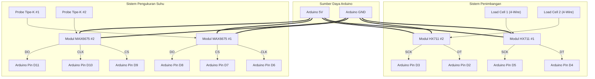

# BUKU PANDUAN PENGGUNA & PENGKABELAN
## Sistem Monitoring IoT: Dual Load Cell (HX711) & Dual Termokopel (MAX6675)
### Disertai Dashboard Desktop Cross-Platform (Windows, macOS, Linux)

---

## DAFTAR ISI
1. [BAB 1: GAMBARAN UMUM SISTEM](#bab-1-gambaran-umum-sistem)
2. [BAB 2: SKEMA PENGKABELAN & WIRING HARDWARE](#bab-2-skema-pengkabelan--wiring-hardware)
   - [2.1 Tabel Pinout Lengkap Arduino Nano](#21-tabel-pinout-lengkap-arduino-nano)
   - [2.2 Standar Warna Kabel Load Cell 4-Kawat](#22-standar-warna-kabel-load-cell-4-kawat)
   - [2.3 Pemasangan Polaritas Probe Termokopel Tipe-K](#23-pemasangan-polaritas-probe-termokopel-tipe-k)
   - [2.4 Diagram Skematik Sirkuit](#24-diagram-skematik-sirkuit)
   - [2.5 Tips Mengatasi Noise & Interferensi](#25-tips-mengatasi-noise--interferensi)
3. [BAB 3: MENJALANKAN GUI DI WINDOWS / MAC / LINUX TANPA INSTALL JDK](#bab-3-menjalankan-gui-di-windows--mac--linux-tanpa-install-jdk)
   - [3.1 Konsep Portable Runtime (Zero-Dependency)](#31-konsep-portable-runtime-zero-dependency)
   - [3.2 Panduan untuk Pengguna Akhir (End-User)](#32-panduan-untuk-pengguna-akhir-end-user)
     - [A. Menjalankan di Microsoft Windows](#a-menjalankan-di-microsoft-windows)
     - [B. Menjalankan di Linux (Ubuntu / Debian / Mint / Arch)](#b-menjalankan-di-linux-ubuntu--debian--mint--arch)
     - [C. Menjalankan di Apple macOS](#c-menjalankan-di-apple-macos)
   - [3.3 Panduan Membuat Paket Portable (Untuk Developer / Distributor)](#33-panduan-membuat-paket-portable-untuk-developer--distributor)
     - [Metode A: Menggunakan JPackage (Native Installer / App-Image)](#metode-a-menggunakan-jpackage-native-installer--app-image)
     - [Metode B: Menggunakan Portable JRE Bundle (Zip Siap Pakai)](#metode-b-menggunakan-portable-jre-bundle-zip-siap-pakai)
4. [BAB 4: PANDUAN LENGKAP PENGGUNAAN APLIKASI GUI](#bab-4-panduan-lengkap-penggunaan-aplikasi-gui)
   - [4.1 Menghubungkan Serial Port (Connect & Disconnect)](#41-menghubungkan-serial-port-connect--disconnect)
   - [4.2 Membaca Kartu Sensor Real-Time & Status](#42-membaca-kartu-sensor-real-time--status)
   - [4.3 Mengubah Satuan (Unit Switching: kg/N dan °C/°F)](#43-mengubah-satuan-unit-switching-kgn-dan-cf)
   - [4.4 Fitur Gabungan Sensor (Load Cell 1+2 & Termokopel 1+2)](#44-fitur-gabungan-sensor-load-cell-12--termokopel-12)
   - [4.5 Wizard Kalibrasi Sensor Interaktif (GUI Tare & Kalibrasi EEPROM)](#45-wizard-kalibrasi-sensor-interaktif-gui-tare--kalibrasi-eeprom)
   - [4.6 Fitur Ekspor & Unduh Data Log ke CSV](#46-fitur-ekspor--unduh-data-log-ke-csv)
   - [4.7 Konsol Serial Raw JSON & Tombol Pintasan](#47-konsol-serial-raw-json--tombol-pintasan)
5. [BAB 5: TROUBLESHOOTING & PERTANYAAN UMUM (FAQ)](#bab-5-troubleshooting--pertanyaan-umum-faq)

---

# BAB 1: GAMBARAN UMUM SISTEM

Sistem Monitoring Sensor IoT ini dirancang untuk membaca, mengolah, menyaring, dan memvisualisasikan data dari dua sensor beban (*Load Cell* dengan modul amplifier HX711) dan dua sensor suhu tinggi (*Thermocouple* Tipe-K dengan modul amplifier digital MAX6675) secara *real-time*.

### Arsitektur Aliran Data:
```
[ Load Cell 1 ] ----> [ Modul HX711 #1 ] \
[ Load Cell 2 ] ----> [ Modul HX711 #2 ] ---\
                                             +---> [ Arduino Nano ]
[ Thermocouple 1 ] -> [ Modul MAX6675 #1 ] --/   (Kalman Filter + EEPROM)
[ Thermocouple 2 ] -> [ Modul MAX6675 #2 ] /                 |
                                                             | (Kabel USB Serial @ 57600 bps)
                                                             v
                                              [ GUI Dashboard Desktop ]
                                              (JavaFX Multi-Platform)
```

### Spesifikasi Sistem:
- **Mikrokontroler**: Arduino Nano (ATmega328P, 16 MHz, 5V).
- **Sensor Beban**: 2x Load Cell (Bridge Strain Gauge) dengan 2x Modul HX711 ADC 24-bit.
- **Sensor Suhu**: 2x Probe Termokopel Tipe-K (rentang -20 °C s.d. 800 °C) dengan 2x Modul MAX6675 SPI ADC 12-bit.
- **Penyaring Derau (*Noise Filter*)**: Algoritma Filter Kalman Adaptif berjalan langsung pada mikrokontroler.
- **Penyimpanan Kalibrasi**: Memori non-volatile EEPROM internal Arduino Nano (faktor kalibrasi tetap tersimpan saat listrik mati).
- **Antarmuka PC**: Dashboard Desktop GUI berbasis JavaFX dengan tema Cyber Dark UI.

---

# BAB 2: SKEMA PENGKABELAN & WIRING HARDWARE

## 2.1 Tabel Pinout Lengkap Arduino Nano

Hubungkan pin modul sensor ke pin digital Arduino Nano sesuai tabel berikut:

| Sensor / Modul | Pin Modul Sensor | Pin Arduino Nano | Fungsi / Keterangan | Tegangan Operasi |
| :--- | :--- | :--- | :--- | :--- |
| **HX711 #1 (Load Cell 1)** | `VCC` | `5V` | Jalur Tegangan Positif | 5V DC |
| | `GND` | `GND` | Jalur Ground Bersama | 0V (Ground) |
| | `DT` / `DOUT` | **`D4`** | Data Serial Output | 5V Logika |
| | `SCK` | **`D5`** | Clock Serial | 5V Logika |
| **HX711 #2 (Load Cell 2)** | `VCC` | `5V` | Jalur Tegangan Positif | 5V DC |
| | `GND` | `GND` | Jalur Ground Bersama | 0V (Ground) |
| | `DT` / `DOUT` | **`D2`** | Data Serial Output | 5V Logika |
| | `SCK` | **`D3`** | Clock Serial | 5V Logika |
| **MAX6675 #1 (Suhu 1)** | `VCC` | `5V` atau `3.3V` | Jalur Tegangan Positif | Rekomendasi 5V / 3.3V stabil |
| | `GND` | `GND` | Jalur Ground Bersama | 0V (Ground) |
| | `CLK` / `SCK` | **`D6`** | Serial SPI Clock | 5V Logika |
| | `CS` | **`D7`** | Chip Select | 5V Logika |
| | `SO` / `DO` | **`D8`** | Serial SPI Data Out | 5V Logika |
| **MAX6675 #2 (Suhu 2)** | `VCC` | `5V` atau `3.3V` | Jalur Tegangan Positif | Rekomendasi 5V / 3.3V stabil |
| | `GND` | `GND` | Jalur Ground Bersama | 0V (Ground) |
| | `CS` | **`D9`** | Chip Select | 5V Logika |
| | `CLK` / `SCK` | **`D10`** | Serial SPI Clock | 5V Logika |
| | `SO` / `DO` | **`D11`** | Serial SPI Data Out | 5V Logika |

---

## 2.2 Standar Warna Kabel Load Cell 4-Kawat

Kabel dari sensor Load Cell dihubungkan ke terminal input modul HX711:

```
[ Sensor Load Cell ]                      [ Modul HX711 ]
   Kabel Merah    ---------------------->    E+  (Excitation +)
   Kabel Hitam    ---------------------->    E-  (Excitation -)
   Kabel Hijau    ---------------------->    A+  (Signal +)
   Kabel Putih    ---------------------->    A-  (Signal -)
   Kabel Kuning / Telanjang (Bila ada) ->    Shield / GND
```

> **Catatan Penting**:
> Jika saat pengujian beban ditekan namun angka timbangan bergerak ke arah negatif (berkurang), Anda cukup menukar kabel **`A+`** (Hijau) dan **`A-`** (Putih), atau melakukan kalibrasi melalui menu Wizard Kalibrasi di aplikasi GUI.

---

## 2.3 Pemasangan Polaritas Probe Termokopel Tipe-K

Probe termokopel memiliki polaritas kutub positif (+) dan negatif (-):

```
[ Probe Termokopel Tipe-K ]              [ Terminal Blok MAX6675 ]
   Kabel Merah / Kuning (Positif) ------>    Terminal (+)
   Kabel Biru / Putih (Negatif)   ------>    Terminal (-)
```

> **Perhatian**:
> Jika probe dipanaskan namun pembacaan suhu di layar justru **turun / mengecil**, artinya pemasangan kedua kabel thermocouple pada terminal blok terbalik. Tukar posisi kedua kabel tersebut.

---

## 2.4 Diagram Skematik Sirkuit



---

## 2.5 Tips Mengatasi Noise & Interferensi

1. **Jalur Ground Bersama (*Common Ground*)**: Pastikan semua pin GND modul HX711 dan MAX6675 terhubung ke GND Arduino Nano dengan kontak yang kokoh.
2. **Kabel Pendek & Terpelintir (*Twisted Pair*)**: Untuk kabel data `DT`/`SCK` dan `CLK`/`DO`, buat lilitan ringan (*twist*) dengan kabel ground untuk meredam gelombang elektromagnetik dari lingkungan sekitar.
3. **Kapasitor decoupling**: Jika pembacaan suhu termokopel berfluktuasi saat didekatkan ke pemanas listrik (induksi), tambahkan kapasitor keramik $0.1\,\mu\text{F}$ (104) di antara terminal `(+)` dan `(-)` thermocouple pada modul MAX6675.

---

# BAB 3: MENJALANKAN GUI DI WINDOWS / MAC / LINUX TANPA INSTALL JDK

## 3.1 Konsep Portable Runtime (Zero-Dependency)

Pengguna biasa seringkali kesulitan jika harus mengunduh JDK (Java Development Kit) berukuran 200–400 MB dan mengatur *Environment Variables* (PATH) di komputer mereka. 

Aplikasi Dashboard ini telah dikonfigurasi agar mendukung **arsitektur portable runtime mandiri**:
- Di dalam folder aplikasi telah disediakan folder `runtime/` atau `jre/` minimalis.
- Launcher script (`run_windows.bat`, `run.sh`, `run_mac.command`) atau berkas native `SensorMonitoring.exe` akan mengeksekusi Java engine langsung dari folder lokal tersebut.
- **Hasilnya**: Pengguna laptop yang sama sekali tidak memiliki Java/JDK di laptopnya tetap dapat langsung menjalankan aplikasi dengan lancar (100% *Zero-Install* / *Plug and Play*).

---

## 3.2 Panduan untuk Pengguna Akhir (End-User)

### A. Menjalankan di Microsoft Windows

1. Unduh atau salin folder **`SensorMonitoring-Windows`** ke laptop Anda (misalnya diekstrak di `D:\SensorMonitoring` atau Desktop).
2. Di dalam folder tersebut, cukup **klik dua kali (double click)** salah satu berkas berikut:
   - **`SensorMonitoring.exe`** (Aplikasi mandiri), ATAU
   - **`run_windows.bat`** (Skrip peluncur otomatis).
3. Dashboard akan langsung terbuka tanpa peringatan error Java!

```
Folder Windows Portable:
SensorMonitoring/
├── runtime/              <-- Berisi mesin Java bawaan (tidak perlu diutak-atik)
├── SensorMonitoring.exe  <-- CUKUP KLIK 2x BERKAS INI
└── run_windows.bat       <-- ATAU KLIK 2x BERKAS INI
```

---

### B. Menjalankan di Linux (Ubuntu / Debian / Mint / Arch)

1. Ekstrak folder **`SensorMonitoring-Linux`**.
2. Berikan izin eksekusi (*executable permission*) sekali saja melalui terminal:
   ```bash
   cd SensorMonitoring-Linux
   chmod +x run.sh
   ```
3. Berikan izin hak akses port serial USB ke user Anda:
   ```bash
   sudo usermod -a -G dialout $USER
   ```
   *(Setelah perintah ini, lakukan logout dan login kembali ke akun Linux Anda agar grup aktif).*
4. Jalankan aplikasi cukup dengan perintah:
   ```bash
   ./run.sh
   ```
   *(Atau klik dua kali berkas `run.sh` dan pilih "Run in Terminal").*

---

### C. Menjalankan di Apple macOS

1. Ekstrak folder **`SensorMonitoring-Mac`**.
2. Berikan izin eksekusi pada skrip peluncur:
   ```bash
   chmod +x run_mac.command
   ```
3. Cukup **klik dua kali berkas `run_mac.command`** atau buka berkas **`SensorMonitor.app`**.
4. Jika macOS menampilkan pesan peringatan keamanan (*Unidentified Developer*):
   - Buka **System Settings** $\rightarrow$ **Privacy & Security**.
   - Gulir ke bawah dan klik tombol **Open Anyway**.

---

## 3.3 Panduan Membuat Paket Portable (Untuk Developer / Distributor)

Jika Anda sebagai pengembang ingin membuat berkas distribusi zip baru untuk dibagikan ke klien/user:

### Metode A: Menggunakan JPackage (Menghasilkan Binary Native EXE / App-Image)

Gunakan perintah `jpackage` resmi bawaan OpenJDK 17 untuk membundel JAR dan modul Java runtime menjadi satu:

```bash
# Masuk ke direktori proyek JavaFX
cd ~/project/load-cell-and-termokopel-monitoring

# 1. Pastikan fat JAR terkompilasi
mvn package -DskipTests

# 2. Buat paket aplikasi mandiri (App-Image)
jpackage \
  --name "SensorMonitor" \
  --input target/ \
  --main-jar load-cell-and-termokopel-monitoring-1.0.0.jar \
  --main-class com.iot.monitoring.Launcher \
  --type app-image \
  --dest dist/
```

Hasilnya di folder `dist/SensorMonitor` berisi *executable* mandiri beserta runtime yang langsung dapat di-*zip* dan dibagikan.

### Metode B: Menggunakan Portable JRE Bundle (Paling Fleksibel)

1. Unduh **BellSoft Liberica "Full JRE"** versi 17 (yang sudah menyertakan JavaFX) sesuai OS target dari [https://bell-sw.com/pages/downloads/](https://bell-sw.com/pages/downloads/).
   - Untuk Windows: `bellsoft-jre17-full-windows-amd64.zip`
   - Untuk Linux: `bellsoft-jre17-full-linux-amd64.tar.gz`
   - Untuk macOS: `bellsoft-jre17-full-macos-amd64.tar.gz`
2. Ekstrak arsip tersebut, lalu ubah nama foldernya menjadi **`runtime`**.
3. Letakkan folder `runtime` tersebut berdampingan dengan berkas `load-cell-and-termokopel-monitoring-1.0.0.jar` dan skrip `run_windows.bat` / `run.sh`.
4. Kompres semua berkas tersebut menjadi file `.zip`. Berkas zip ini siap dijalankan di komputer mana pun tanpa instalasi tambahan!

---

# BAB 4: PANDUAN LENGKAP PENGGUNAAN APLIKASI GUI

## 4.1 Menghubungkan Serial Port (Connect & Disconnect)

1. Tancapkan kabel USB Arduino Nano ke port USB laptop/PC Anda.
2. Buka aplikasi **Sensor Monitoring Dashboard**.
3. Di panel atas (*Action Bar*):
   - **Port**: Pilih nama port serial Arduino Anda (Contoh: `COM3`, `COM4` di Windows, atau `/dev/ttyUSB0`, `/dev/ttyACM0` di Linux). Jika port belum muncul, klik tombol **`🔄 Refresh`**.
   - **Baud Rate**: Pastikan memilih **`57600`** (kecepatan transmisi standar firmware).
4. Klik tombol **`Connect`**.
5. Tombol akan berubah warna menjadi merah **`Disconnect`** dan badge status di pojok kanan atas akan berubah hijau **`TERHUBUNG`**. Aliran data sensor akan langsung tampil seketika!

---

## 4.2 Membaca Kartu Sensor Real-Time & Status

Pada baris atas dashboard, terdapat 4 kartu metrik pintar:

1. **LOAD CELL 1**:
   - Menampilkan berat utama (misal: `0.28 kg`).
   - Menampilkan nilai gaya (misal: `Gaya: 2.7 N`).
   - Badge status: `KOSONG` (abu-abu jika $\le 0.05\text{ kg}$) atau `TERTIMBANG` (cyan menyala jika ada beban).
2. **LOAD CELL 2**:
   - Menampilkan berat sensor 2 dengan tema oranye neon.
   - Badge status: `KOSONG` atau `TERTIMBANG`.
3. **TERMOKOPEL 1**:
   - Menampilkan suhu utama (misal: `28.5 °C`) dengan tema hijau neon.
   - Menampilkan konversi Fahrenheit sekunder (`Fahrenheit: 83.3 °F`).
   - Badge status: `AKTIF` (hijau) atau `TERPUTUS` (merah jika probe lepas).
4. **TERMOKOPEL 2**:
   - Menampilkan suhu sensor 2 dengan tema merah neon.
   - Badge status: `AKTIF` atau `TERPUTUS`.

---

## 4.3 Mengubah Satuan (Unit Switching: kg/N dan °C/°F)

Anda dapat mengubah satuan pembacaan kapan saja secara interaktif:

- **Satuan Beban**: Klik tombol toggle **`[ kg ]`** atau **`[ Newton ]`** di pojok kanan atas grafik beban.
  - Saat memilih `kg`: Kartu dan grafik menampilkan massa dalam Kilogram ($kg$).
  - Saat memilih `Newton`: Kartu dan grafik menampilkan gaya mekanik dalam Newton ($N = m \times 9.80665$).
  - Label sumbu Y pada grafik otomatis menyesuaikan secara dinamis.
- **Satuan Suhu**: Klik tombol toggle **`[ °C ]`** atau **`[ °F ]`** di pojok kanan atas grafik suhu.
  - Seluruh riwayat data pada grafik langsung terkonversi otomatis ($^\circ\text{F} = ^\circ\text{C} \times 1.8 + 32$).

---

## 4.4 Fitur Gabungan Sensor (Load Cell 1+2 & Termokopel 1+2)

Pada sistem mekanik dan termal, seringkali Anda ingin mengetahui **Total Beban Gabungan** atau **Total Suhu Gabungan**:

### A. Mode Gabungan Beban (Load Cell 1 + 2)
1. Di bawah grafik Tren Beban, klik radio button **`Gabungan (LC 1 + 2)`**.
2. **Kartu Atas Otomatis Menyatu**: Dua kartu Load Cell 1 & 2 di atas otomatis menghilang dan digantikan oleh 1 kartu tunggal:
   - Judul: **`TOTAL BEBAN GABUNGAN (LC 1 + LC 2)`** dengan aksen ungu neon (`#e040fb`).
   - Menampilkan total penjumlahan massa ($W_1 + W_2$) dan total gaya ($F_1 + F_2$) secara simultan.
3. **Grafik Menjadi 1 Kurva Tunggal**: Kurva beban berubah menjadi 1 baris kurva ungu neon yang memperlihatkan total tumpuan beban secara riil.

### B. Mode Gabungan Suhu (Termokopel 1 + 2)
1. Di bawah grafik Tren Suhu, klik radio button **`Gabungan (TC 1 + 2)`**.
2. **Kartu Atas Otomatis Menyatu**: Dua kartu Termokopel 1 & 2 di atas otomatis menyatu menjadi 1 kartu emas:
   - Judul: **`TOTAL SUHU GABUNGAN (TC 1 + TC 2)`** dengan aksen kuning emas (`#ffd600`).
   - Menampilkan penjumlahan total suhu ($T_1 + T_2$).
3. **Grafik Menjadi 1 Kurva Tunggal**: Grafik suhu hanya menampilkan 1 garis kurva emas gabungan.

*(Untuk kembali menampilkan masing-masing sensor terpisah, cukup klik kembali tombol radio `Semua (1 & 2)`)*.

---

## 4.5 Wizard Kalibrasi Sensor Interaktif (GUI Tare & Kalibrasi EEPROM)

Anda dapat mengkalibrasi Load Cell tanpa perlu membongkar kode program (*zero coding*):

1. Pastikan port serial sudah dalam keadaan **`TERHUBUNG`**.
2. Klik tombol **`🎯 Wizard Kalibrasi Sensor`** pada panel atas.
3. Jendela dialog kalibrasi akan terbuka:
   - **Pilih Sensor**: Pilih `Load Cell 1` atau `Load Cell 2`.
   - **Langkah 1 (Titik Nol / Tare)**:
     - Kosongkan dudukan timbangan (jangan ada beban apa pun di atas sensor).
     - Klik tombol **`⚖ Nolkan Sensor (Tare)`**.
     - Indikator status akan berubah hijau: `✔ Titik nol (tare) berhasil diset!`.
   - **Langkah 2 (Beban Kalibrasi Uji)**:
     - Letakkan benda uji yang sudah Anda ketahui bobot pastinya di atas timbangan.
     - Ketikkan angka beratnya pada kotak input.
     - Pilih satuan: **`gram (g)`** atau **`kg`** (Contoh: ketik `500` lalu pilih `gram (g)`, atau ketik `1.0` lalu pilih `kg`).
     - Klik tombol **`🚀 Kalibrasi & Simpan ke EEPROM`**.
4. Mikrokontroler akan melakukan *averaging* pembacaan ADC selama 1.5 detik, menghitung faktor kalibrasi baru, dan langsung menyimpannya secara permanen ke memori EEPROM Arduino Nano!
5. Klik **Tutup**. Timbangan Anda kini telah terkalibrasi dengan presisi tinggi.

---

## 4.6 Fitur Ekspor & Unduh Data Log ke CSV

Aplikasi secara otomatis mencatat setiap data pembacaan sensor ke dalam memori log.

1. Perhatikan tombol **`📥 Download CSV (X)`** di bagian atas atau di header konsol log. Angka `(X)` menunjukkan jumlah baris sampel data yang telah berhasil direkam secara *real-time*.
2. Klik tombol **`📥 Download CSV`**.
3. Dialog pemilih berkas (*FileChooser*) akan muncul dengan nama berkas default otomatis berbasis timestamp, contoh: `sensor_log_20260901_143000.csv`.
4. Pilih folder penyimpanan yang Anda inginkan (misal di Documents atau Flashdisk), lalu klik **Save**.
5. Berkas CSV berstandar internasional RFC 4180 berhasil dibuat dan dapat langsung dibuka di **Microsoft Excel**, **Google Sheets**, atau dianalisis dengan **Python Pandas** / **MATLAB**.

### Struktur Kolom Berkas CSV:
```csv
Timestamp,Sample_Index,LoadCell1_Berat_kg,LoadCell1_Gaya_N,LoadCell2_Berat_kg,LoadCell2_Gaya_N,Total_Berat_kg,Total_Gaya_N,Termokopel1_Suhu_C,Termokopel1_Fahrenheit_F,Termokopel2_Suhu_C,Termokopel2_Fahrenheit_F,Total_Suhu_C,Total_Fahrenheit_F
2026-09-01 14:30:01.120,1,0.280,2.75,0.180,1.77,0.460,4.52,28.50,83.30,29.00,84.20,57.50,167.50
```

---

## 4.7 Konsol Serial Raw JSON & Tombol Pintasan

- **Konsol Serial**: Menampilkan data string mentah dalam format JSON yang dikirimkan oleh mikrokontroler setiap 500 ms.
- **Tombol Pintasan Tambahan**:
  - **`Tare Timbangan`**: Mengirim perintah cepat `'t'` untuk menolkan beban saat ini.
  - **`Format JSON`**: Mengirim perintah `'j'` untuk mengubah tampilan output serial antara format ringkas (*compact*) satu baris atau format berlekuk (*indented*).
  - **`Bersihkan Grafik`**: Mengosongkan riwayat kurva pada grafik dan mereset sumbu X ke titik 0.
  - **`Bersihkan Konsol`**: Menghapus riwayat teks pada area log konsol bawah.

---

# BAB 5: TROUBLESHOOTING & PERTANYAAN UMUM (FAQ)

### Q1: Mengapa nama port serial (COM / tty) tidak muncul di ComboBox?
- **Penyebab**: Kabel USB longgar atau driver chip USB-to-UART belum terpasang di komputer Anda.
- **Solusi**:
  - Jika menggunakan Arduino Nano Clone (chip CH340), unduh dan pasang driver **CH341SER** untuk Windows/Mac.
  - Cabut dan colokkan kembali kabel USB, lalu klik tombol **`🔄 Refresh`** pada dashboard.

### Q2: Mengapa status Termokopel bertuliskan "TERPUTUS" / "Probe lepas"?
- **Penyebab**: Modul MAX6675 mendeteksi sirkuit terbuka (*open circuit*) pada pin terminal thermocouple (kabel probe tidak terhubung atau longgar).
- **Solusi**: Kencangkan sekrup terminal blok pada modul MAX6675 yang menjepit probe tipe-K. Pastikan kedua ujung kawat thermocouple terhubung erat.

### Q3: Mengapa pembacaan Load Cell tidak bergerak atau angkanya tidak sesuai?
- **Penyebab**: Sensor belum dikalibrasi atau faktor kalibrasi di EEPROM bernilai default.
- **Solusi**: Buka menu **`🎯 Wizard Kalibrasi Sensor`**, lakukan langkah Nolkan Sensor (Tare), lalu letakkan beban uji dan klik Simpan ke EEPROM.

### Q4: Di Linux, muncul pesan error "Permission Denied" saat membuka port `/dev/ttyUSB0`?
- **Penyebab**: Pengguna Linux belum masuk ke grup `dialout` yang berhak mengakses perangkat serial hardware.
- **Solusi**: Buka terminal dan jalankan:
  ```bash
  sudo usermod -a -G dialout $USER
  ```
  Kemudian lakukan *Log Out* dan *Log In* kembali ke Linux Anda.

### Q5: Apakah data kalibrasi hilang jika kabel USB Arduino dicabut?
- **Tidak**. Seluruh faktor kalibrasi dan titik nol disimpan langsung ke memori internal **EEPROM ATmega328P**, sehingga nilai kalibrasi tetap tersimpan permanen meskipun Arduino dimatikan atau dipindahkan ke komputer lain.

---

*Buku Panduan ini disusun untuk pengoperasian sistem IoT Sensor Monitoring (Dual Load Cell & Dual Thermocouple).*

